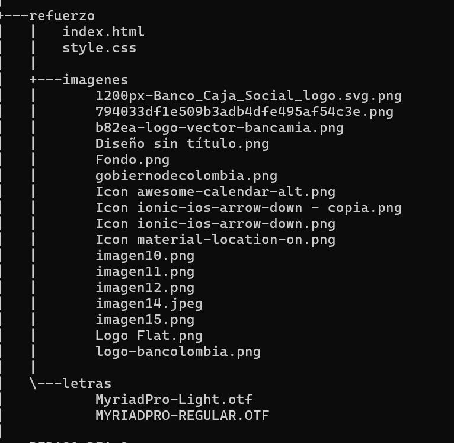
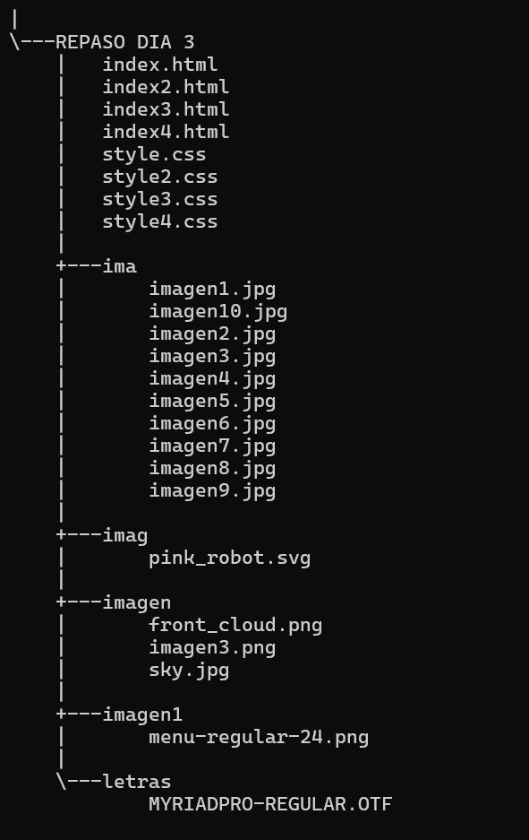

# README del módulo de HTML y CSS

Este módulo esta dividido en 10 días, un día de refuerzo y otro día de repaso:

## Tabla de contenido
| Índice | Título |
|--|--|
| 1 | módulo 1 |
| 2 | módulo 2 |
| 3 | módulo 3 |
| 4 | módulo 4 |
| 5 | módulo 5 |
| 6 | módulo 6 |
| 7 | módulo 7 |
| 8 | módulo 8 |
| 9 | módulo 9 |
| 10 | módulo 10 |
| 11 | refuerzo | 
| 12 | repaso |

## Módulo 1

### Descripción

La primera página web esta basada en mi información personal la cual contiene:
1. mi nombre, mi edad, mis estudios.
2. una foto y les hable un poco sobre mi proyecto.

### Tecnologías utilizadas
* HTML
* Tipos de letra que ya viene preestablecido por html.

### Estructura del proyecto
Aquí podras ver lo utlizado para realizar el proyecto:

.png>)

### Caracteristícas
* Archivo [Ejercicio1_PerezYessica.html]:El cual contiene el código principal.

## Módulo 2

### Descripción

Esta seria el segundo proyecto el cual también esta basado en mi información personal pero ya un poco más detallado el cual contiene lo siguiente:

1. Una foto mía, mi nombre, mi dirección de residencia, correo, link de github y una foto de un diploma.
2. Información academica y habilidades.
3. Proyecto personales y proyecto empresariales.

### Tecnologías utilizadas

* HTML.
* CSS.
* Tipos de letra preestablecido por html.

### Estructura del proyecyo
Aquí podras observar lo utlizado para realizar el proyecto:

### Caracteristícas
* Archivo [Ejercicio2_PerezYessica.html]: El cual contiene el código principal.
* Archivo [style.css]:El cual nos permite llevar a cabo la realización del diseño de la página.

## Módulo 3

### Descripción
Maquetación de una página web la cual es de una empresa de metrolinea la cual contiene:

1. Ver el saldo de la tarjeta.
2. Comprar la tarjeta de metrolinea.
3. Ver el saldo actual y a quien pertenece.

### Tecnologías utilizadas

* HTML.
* CSS.
* Imagenes.
* Tipo de letra preestablecido por html.

### Estructura del proyecto
Aquí podras observar lo utlizado para realizar el proyecto:

### Caracteristícas
* Archivos [index.html]: Los cuales contiene el código principal.
* Archivos [style.css]:El cual nos permite llevar a cabo la realización del proyecto.
* Carpeta [imagenes]:Esta carpeta contiene las imagenes utilizadas en el proyecto.
* Carpeta paginas la cual contiene un archivo [comprartarjeta.html].

## Módulo 4

### Descripción

Maquetación de una página web de Amazon prime la cual contiene:

1. Descripción de la página.
2. Una lista de peliculas que puedes ver.
3. Los dispositivos que puedes utilizar para ver dichas peliculas.

### Tecnologías utlizadas
* HTML.
* CSS.
* font AmazonEmber (Bdlt.ttf, Th, Th.ttf).
* imagenes.

### Estructura del proyecto

Aquí podras observar lo utlizado para realizar el proyecto:

### Caracteristícas

* Archivo [index.html]:Contiene el código principal.
* Archivo [style.css]:Nos permite llevar a cabo la realización del proyecto.
* Carpeta [imagenes]:Contiene todas la imagenes utilizadas en el proyecto.
* Carpeta font[font]: Contiene los tipos de letras utilizados en el prpyecto.

## Módulo 5

### Descripción

Maquetación de una página web de restaurante, la cual contiene lo siguiente:

1. Nos permite ingresar a unos espacios de la página.
2. Nos da unas opciones de comida y aprender más acerca de ellas.

### Tecnologías utlizadas
* HTML.
* CSS.
* letras Poppins (ExtraLight.ttf, Light.ttf, LightItalic.ttf, Regular.ttf).
* imagenes.

### Estructura del proyecto

Aquí podras observar lo utilizado para realizar el proyecto:

### Caracteristícas

* Archivo [index.html]:Contiene el código principal.
* Archivo [style.css]:Nos permite llevar a cabo la realización del proyecto.
* Carpeta [imagenes]:Contiene todas la imagenes utilizadas en el proyecto.
* Carpeta font[font]: Contiene los tipos de letras utilizados en el prpyecto.

## Módulo 6

### Descripción
Maquetación de una página web del gobierno encargada de tramitar el RUNT  y la firma electrónica la cual contiene:

1. Tramitar el RUNT sacando una cita antes de ir al lugar.
2. Agenda la cita.
3. Redirecciona a todas las partes de la página web.

### Tecnologías utilizadas

* HTML.
* CSS.
* letras MyriadPro (Light.otf y REGULAR.OTF).
* imagenes.

### Estrcutura del proyecto

Aquí podras obervar lo utilizado para realizar el proyecto:

### Caracteristícas 
* Archivo [index.html]:Contiene el código principal.
* Archivo [style.css]:Nos permite llevar a cabo la realización del proyecto.
* Carpeta [imagenes]:Contiene todas la imagenes utilizadas en el proyecto.
* Carpeta letras[font]: Contiene los tipos de letras utilizados en el prpyecto.

## Módulo 7

### Descripción
Maquetación de una página web de restaurante,la cual tambien es responsive, la cual contiene lo siguiente:

1. Nos permite ingresar a unos espacios de la página.
2. Nos da unas opciones de comida y aprender más acerca de ellas.

### Tecnologías utlizadas
* HTML.
* CSS.
* letras Poppins (ExtraLight.ttf, Light.ttf, LightItalic.ttf, Regular.ttf).
* imagenes.

### Estructura del proyecto

Aquí podras observar lo utilizado para realizar el proyecto:

### Caracteristícas 
* Archivo [index.html]:Contiene el código principal.
* Archivo [style.css]:Nos permite llevar a cabo la realización del proyecto.
* Carpeta [imagenes]:Contiene todas la imagenes utilizadas en el proyecto.
* Carpeta letras[letras]: Contiene los tipos de letras utilizados en el proyecto.

## Módulo 8

Maquetación de página basadas en grillas, la cual contien:

1. Esta dividida en 2 módulos.
2. contiene 4 videos y 3 imagenes.

### Tecnologías utlizadas
* HTML.
* CSS.
* imagenes.

### Estructura del proyecto

Aquí podras observar lo utilizado para realizar el proyecto:

### Caracteristícas 
* Archivo [index.html]:Contiene el código principal.
* Archivo [style.css]:Nos permite llevar a cabo la realización del proyecto.
* Carpeta [imagenes]:Contiene todas la imagenes utilizadas en el proyecto.

## Módulo 9

### Descripción
Maquetación de una página web en la cual se le implementa animación:

1. Tiene un sol el cual al pasar unos segundos aperce y desaparece.
2. Tiene una nube la cual al llegar a un punto llueve.
3. Tiene flor la cual aparece apenas llueve.

### Tecnologías utlizadas
* HTML.
* CSS.
* imagenes.

### Estructura del proyecto

Aquí podras observar lo utilizado para realizar el proyecto:

### Caracteristícas 
* Archivo [index.html]:Contiene el código principal.
* Archivo [style.css]:Nos permite llevar a cabo la realización del proyecto.
* Carpeta [imagenes]:Contiene todas la imagenes utilizadas en el proyecto.

## Módulo 10

### Decripción 
Maquetación de una página web la cual también lleva animación a la hora de ingresar a unos modulos, la cual contiene:

1. Nos muestra un reporte de tablas y formas.
2. Nos muestra un reporte de elementos, charts y widgets.

### Tecnologías utlizadas
* HTML.
* CSS.
* imagenes.

### Estructura del proyecto

Aquí podras observar lo utilizado para realizar el proyecto:

### Caracteristícas 
* Archivo [index.html]:Contiene el código principal.
* Archivo [style.css]:Nos permite llevar a cabo la realización del proyecto.
* Carpeta [imagenes]:Contiene todas la imagenes utilizadas en el proyecto.
* Carpeta letras[letras]: Contiene los tipos de letras utilizados en el proyecto.

## Refuerzo

### Descripción 
Maquetación de una página web encargada del ingreso solidario la cual contiene:

1. Tiene un apartado donde podras obtener información del ongreso solidario.
2. Tendras información sobre las etapas de entregas de incentivos.

### Tecnologías utlizadas
* HTML.
* CSS.
* imagenes.
* letras MyriadPro (Light.otf y REGULAR.OTF)

### Estructura del proyecto

Aquí podras observar lo utilizado para realizar el proyecto:

### Caracteristícas 
* Archivo [index.html]:Contiene el código principal.
* Archivo [style.css]:Nos permite llevar a cabo la realización del proyecto.
* Carpeta [imagenes]:Contiene todas la imagenes utilizadas en el proyecto.
* Carpeta letras[letras]: Contiene los tipos de letras utilizados en el proyecto.

## Repaso

### Descripción 
Maquetación de varios proyectos los cuales contiene animación, también contienen:

1. Una página letra la cual se voltean y quedan al reves.
2. Una página de nubes la cual se desplazan por la pantalla una más rapido que otra.
3. Una página de un señor caminando.
4. Una página de robot el cual cambia de color.

### Tecnologías utlizadas
* HTML.
* CSS.
* imagen.
* ima.
* imag.
* imagen1.
* letras MyriadPro (REGULAR.OTF)

### Estructura del proyecto

Aquí podras observar lo utilizado para realizar el proyecto:

### Caracteristícas 
* Archivo [index.html]:Contiene el código principal.
* Archivo [style.css]:Nos permite llevar a cabo la realización del proyecto.
* Carpeta [imagen]:Contiene todas la imagenes utilizadas en el proyecto.
* Carpeta [ima]:Contiene todas la imagenes utilizadas en el proyecto.
* Carpeta [imag]:Contiene todas la imagenes utilizadas en el proyecto.
* Carpeta [imagen1]:Contiene todas la imagenes utilizadas en el proyecto.
* Carpeta letras[letras]: Contiene los tipos de letras utilizados en el proyecto.

### Instrucciones

1. Clonar el repositorio cargado en GitHub.
2. Abrir en la nube el archivo de HTML. 

### Desarrollado por
El proyecto fue desarrollado por Yessica Andrea Perez Machuca estudiante de Campuslands como trabajo de dias de estudio.
